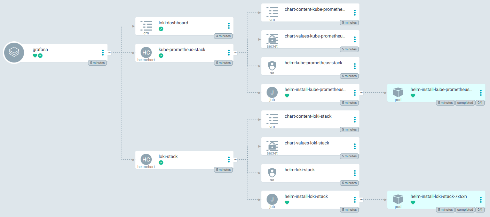
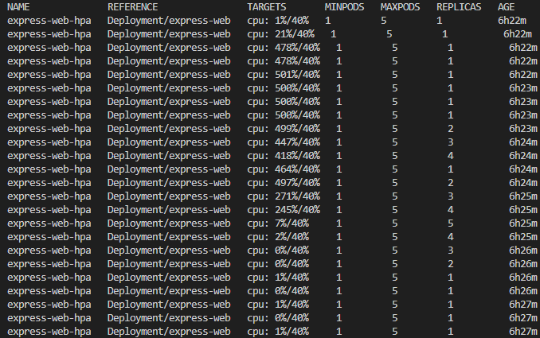

# CloudServ7-project
Cloud Services Projekt Gruppe 7: Zentraler dienst für installationen


## Dateien

> "main.tf" => Terraform Grundlage
-> Legt fest, welche Instanzen mit welcher Spezifikation gestartet werden
-> Definiert Worker und Controller

> "terraform.tfvars.example" => Beispiel Variablen für Terraform
-> Vor gebrauch datei Kopieren, ".example" entfernen und Variablen anpassen

> "clear_setup.sh" => Versuch für einfaches Destroy Skript
-> ignorieren (hatten nicht genug zeit Fehler zu beheben)

Manifests (Ordner):

>"cloud-controller-openstack.yaml.tpl" => OpenStack Cloud Controller Management
-> Bindeglied zwischen Openstack und Kubernetes
-> für LoadBalancer über OpenStack, Node-Infos, Volumes / IPs

>"csi-cinder-sc.yaml.tpl" => CSI Block Storage
-> Persistente Volumes
-> Daten bleiben erhalten auch wenn Pods neu starten

>"csi-cinder-sc.yaml.tpl" => StorageClass Definition
-> Legt fest, welches Storage benutzt wird

>"csi-cinder-snapclass.yaml" => Volume Snapshot Class
-> Snapshots von persistenten Volumes
-> Grundlage für Backups über Velero

>"velero-ns.yaml" => Namespace für Velero
-> Backup und Restore von Volumes

>"velero.yaml.tpl" => Velero Deployment
-> Kubernetes Backups und Wiederherstellung

>"monitoring.yaml" => Prometheus Monitoring
-> Metriken und Cluster Überwachung
-> Kommentare Beachten!
-> Unbedingt vor benutzung hart codiertes Passwort und anmeldename für Grafana aendern!

>"logging.yaml" => Loki Logging
-> Logs von Pods und Nodes 
-> Zentrale Log-Analyse
-> beinhaltet eigenes erstelltes Dashboard
-> Kommentare Beachten!
-> Unbedingt vor benutzung hart codiertes Passwort und anmeldename für Grafana aendern!


## manuelles stoppen der Ressourcen
Reihenfolge beachten, teilweise wichtig aufgrund von Abhängigkeiten
1. terraform destroy
2. Datenträger löschen
3. Floating IPs freigeben
4. Router löschen
5. Sicherheitsgruppen löschen (außer default)
6. Load Balancers löschen
7. Ports von cloudserv7-k8s-net (Netzwerk) löschen
8. cloudserv7-k8s-net löschen

Notwendige Ansicht, bevor das nächste Mal terraform apply ausgeführt werden sollte:#

## Starten von ArgoCD
1. chmod +x argocd.sh
2. sed -i 's/\r$//' argocd.sh
3. ./argocd.sh
4. IP-Adresse im Browser aufrufen und einloggen


## Horizontal Pod Autoscaling (HPA) testen
Terminal 1: k6 run loadtest/k6-express-web.js

Terminal 2: export KUBECONFIG="$PWD/cloudserv7-k8s.rke2.yaml"

kubectl get hpa -n argocd -w

ggf. export TARGET_IP=$(kubectl get svc express-web -n argocd -o jsonpath='{.status.loadBalancer.ingress[0].ip}')



## Probleme und Lösungen
### Monitoring und Logging
Bei dem Grafana, welches mit Loki verbunden war, haben wir mit 
```
kubectl get secret --namespace logging -l app.kubernetes.io/component=admin-secret -o jsonpath="{.items[0].data.admin-password}" | base64 --decode ; echo
```
kein Passwort, sondern einen Fehler bekommen. Bei Monitoring ging alles seltsamer weise.
-> Gelöst haben wir das, indem wir in den HelmCharts von Monitoring und Logging das Passwort und ein Benutzername selbst festgelegt haben. Das ist natürlich weniger sicher wenn es Hartcodiert ist und sollte (wie in den Kommentar bereits erwähnt) dringend geändert werden vor der Benutzung!

Zudem hatten wir das Problem mit dem eigenen Dashboard, dass das Dashboard an sich zwar beim Start immer geladen hat, aber die Felder alle immer "No Data" angezeigt haben.
Das lag daran, dass die JSON, die das Dashboard definiert und in der ConfigMap in Logging gespeicht wurde, direkt von Grafana exportiert wurde und die UIDs bei der Datasource falsch waren. Diese Ändern sich!
-> Daher haben wir das Problem einfach gelöst, indem wir sämliche UID-Felder von der Datasource in der JSON leer lassen. Grafana regelt dann den rest.
 
